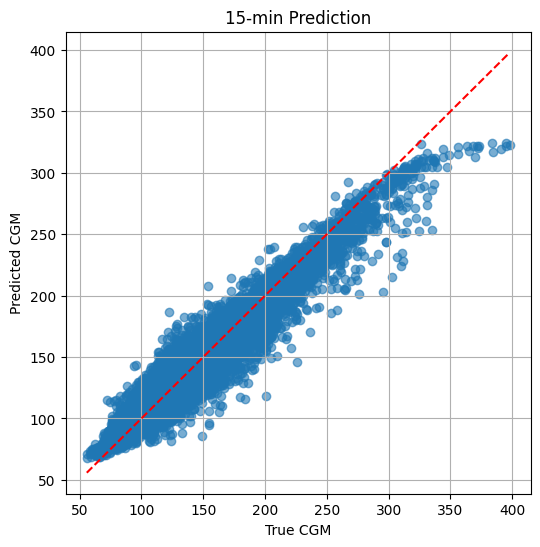
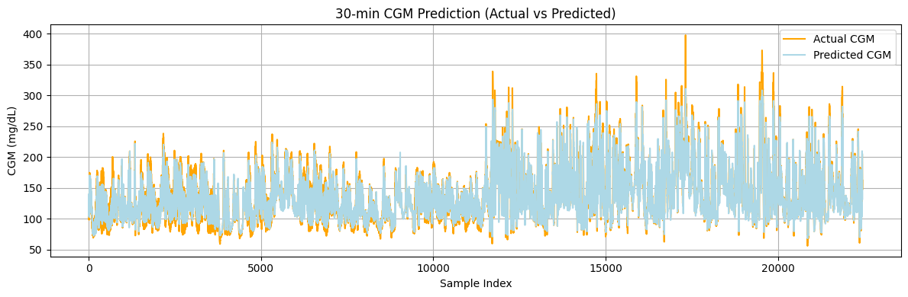
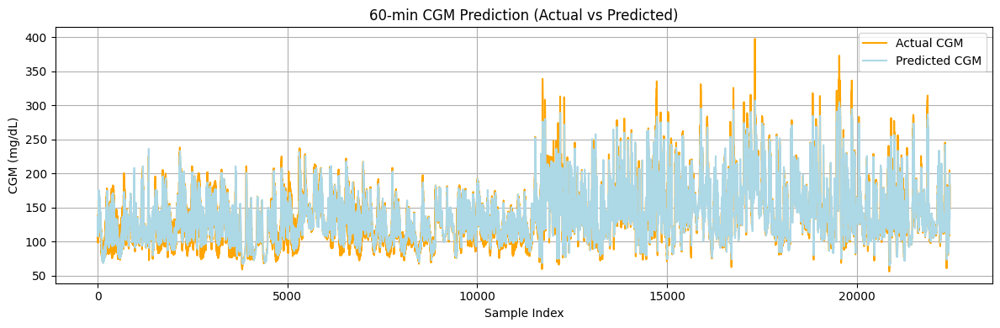
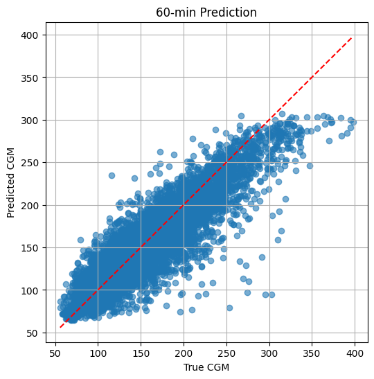
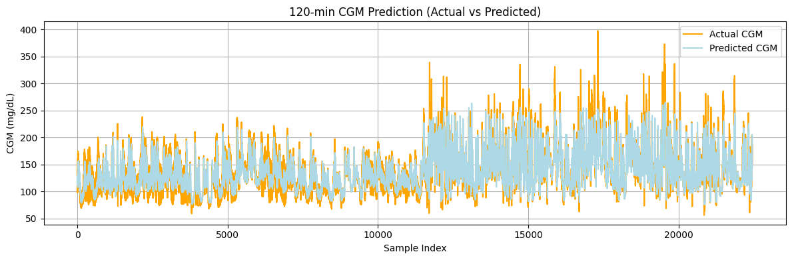
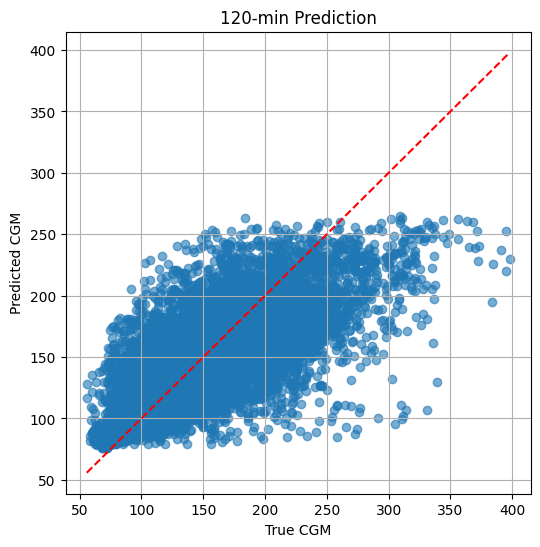
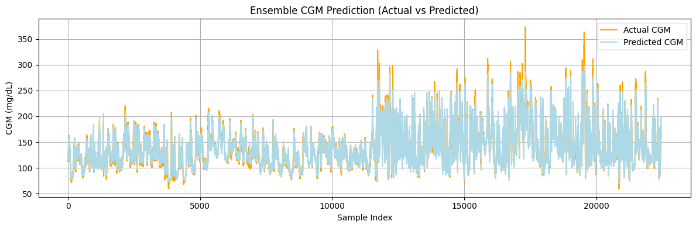
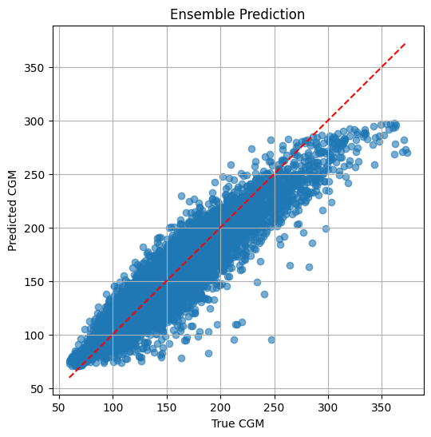

# BILSTM MULTI HORIZON PREDICTION OF INTERVALS (15, 30, 60, 120 MINUTES)

## 15 MINUTES

## 30 MINUTES

## 60 MINUTES

## 120 MINUTES

## ENSEMBLE 

# CLARKE'S GRID ANALYSIS

### Clarke Grid for 15-min:
#### Zone A: 93.31%, B: 6.68%, C: 0.02%, D: 0.00%, E: 0.00%
### Clarke Grid for 30-min:
#### Zone A: 93.73%, B: 6.23%, C: 0.04%, D: 0.00%, E: 0.00%
### Clarke Grid for 60-min:
#### Zone A: 88.12%, B: 11.67%, C: 0.18%, D: 0.03%, E: 0.00%
### Clarke Grid for 120-min:
#### Zone A: 71.93%, B: 27.26%, C: 0.72%, D: 0.09%, E: 0.00%
### Clarke Grid for Ensemble:
#### Zone A: 92.11%, B: 7.84%, C: 0.04%, D: 0.00%, E: 0.00%